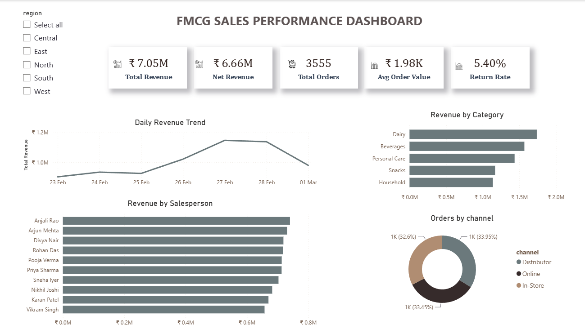

# FMCG Sales Analytics

End-to-end sales analytics project simulating the daily reporting workflow of an FMCG distributor: automated data generation, SQL analysis, statistical validation, exploratory analysis in Python, and an interactive Power BI dashboard.

## Dashboard



Built in Power BI (`dashboard/daily_sales_dashboard.pbix`), covering
23 Feb – 01 Mar (3,555 orders after cleaning), tracking:

- KPI cards: Total Revenue, Net Revenue, Total Orders, Average Order Value, Return Rate
- Daily revenue trend
- Revenue by product category and by salesperson
- Order distribution across channels (Distributor, Online, In-Store)

## Project Overview

The pipeline covers the full analytics lifecycle:

1. **Data generation** — `generate_daily_sales.py` produces one CSV of realistic distributor sales per day. Relationships are deliberately built into the data (discount elasticity, salesperson skill, regional strength, weekday seasonality) so downstream analysis finds real signal, not noise. Output is reproducible: the same date always generates the same data.
2. **Automation** — `run_sales.bat` runs the generator on a schedule via Windows Task Scheduler, with timestamped logging to `logs/`.
3. **Database layer** — `load_database.py` loads all daily CSVs into SQLite (`fmcg_sales.db`) and creates a `sales_clean` view that handles missing values, negative quantities, and duplicate order IDs, plus a `targets` dimension table for quota-vs-actual analysis.
4. **SQL analysis** — `sales_analysis.sql` answers business questions with window functions, CTEs, and joins: salesperson rankings, category profitability, regional performance, discount impact, and target attainment. `sales_analysis.py` runs those queries and formats the results for reading.
5. **Exploratory analysis** — `analyse_sales.py` and `FMCG_Sales_Analysis.ipynb` clean the raw data, quantify data quality issues, and produce five charts in `charts/` (daily trend, category revenue, top products, regional analysis, discount analysis).
6. **Statistical validation** — `statistical_tests.py` tests whether observed differences are real or sampling noise, using ANOVA, correlation, and t-tests. Each test reports both a p-value and an effect size, since with ~3,900 cleaned rows (3,555 completed orders after excluding returns) statistical significance alone is not enough to justify a business decision.
7. **Dashboard** — cleaned data (`fmcg_sales_cleaned.csv`) feeds the Power BI dashboard (see above).

## Key Findings

> **Note on interpretation:** This dataset is synthetic. The relationships below
> (discount elasticity, salesperson skill, regional strength) were built into the
> generator, so these results demonstrate that the analysis pipeline correctly
> recovers known effects — with effect sizes, not just p-values. The value is in
> the method, not the conclusions.

**Discounting quietly erodes revenue.** Higher discounts do lift unit volume, but the lift falls short of the break-even point, so every extra point of discount reduces net revenue per order. Recommendation: cap routine discounts and reserve deep discounts for strategic accounts.

**Top-performer gaps are real, not luck.** Statistical testing (ANOVA with effect size) confirms that differences in salesperson revenue are genuine performance differences rather than sampling noise, which makes the ranking a defensible basis for incentive and bonus allocation.

**Geography matters.** Metro-heavy regions (West and South) outperform on both order volume and average order size, pointing to where expansion and inventory investment will yield the most return.

**Two categories carry the business.** Dairy and Beverages are the leading revenue drivers, while Distributor-channel orders are substantially larger than Online orders, making bulk distributor relationships the highest-value segment to protect.

**Returns are a measurable leak.** The return rate holds at roughly 5% of orders, quantified in rupee terms as direct revenue loss, and worth tracking as a standing KPI.

## Repository Structure

```
├── generate_daily_sales.py     # Daily sales data simulator (seeded, reproducible)
├── run_sales.bat               # Task Scheduler automation with logging
├── load_database.py            # CSV -> SQLite loader with cleaning view
├── sales_analysis.sql          # Business analysis queries (window functions, CTEs)
├── sales_analysis.py           # Runs the SQL above and formats the results
├── analyse_sales.py            # EDA script: cleaning, insights, 5 charts
├── FMCG_Sales_Analysis.ipynb   # EDA notebook version
├── statistical_tests.py        # Hypothesis testing with effect sizes
├── requirements.txt            # Python dependencies
├── daily_sales_data/           # Raw daily CSV files
├── charts/                     # Exported analysis charts (PNG)
├── dashboard/                  # Power BI dashboard (.pbix) and screenshot
├── fmcg_sales_cleaned.csv      # Cleaned dataset feeding the dashboard (generated)
├── fmcg_sales.db               # SQLite database (generated by load_database.py)
└── logs/                       # Timestamped scheduler run logs (generated, not committed)
```

## Tools and Skills

- **Python** — pandas, NumPy, Matplotlib, Seaborn, SciPy
- **SQL** — SQLite; window functions, CTEs, views, joins
- **Statistics** — ANOVA, t-tests, correlation, effect sizes
- **Power BI** — data modeling, DAX measures, interactive visuals
- **Automation** — Windows Task Scheduler, batch scripting, logging

## How to Run

```bash
# Install dependencies
pip install -r requirements.txt

# Generate a day of sales data (today, or backfill a date)
python generate_daily_sales.py
python generate_daily_sales.py 2026-06-22

# Load all CSVs into SQLite, then run the business analysis queries
python load_database.py
python sales_analysis.py

# Or run the raw SQL directly, if you have the sqlite3 CLI
sqlite3 fmcg_sales.db < sales_analysis.sql

# Run the EDA (writes 5 charts to charts/) and the statistical tests
python analyse_sales.py
python statistical_tests.py
```

Open `dashboard/daily_sales_dashboard.pbix` in Power BI Desktop to explore the dashboard.

## Author

**Nethra Jagathisan**

Data Analyst

[LinkedIn](https://www.linkedin.com/in/nethra-jagathisan) · [Email](mailto:nethrajagathisan@gmail.com)


